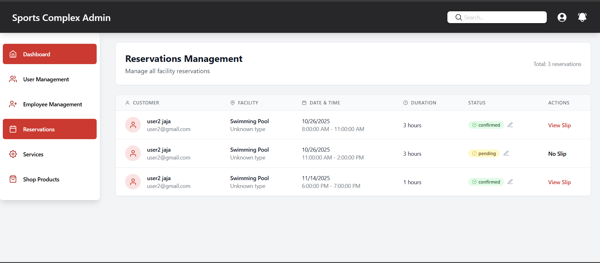

# SportsComplexReservation
# Sports Complex Reservation System (MERN Stack)

A full-stack **MERN** (MongoDB, Express.js, React.js, Node.js) web application for managing sports facility reservations and memberships.  
This system includes **user** and **admin** dashboards, providing a smooth booking experience for users and efficient management tools for administrators.

---

## 🚀 Features

### 👤 User Side
- **User Authentication** – Register and log in securely using JWT-based authentication.
- **Book Time Slots** – View available sports facilities and book time slots for favorite sports.
- **Membership Registration** – Register for different membership packages (Basic, Silver, Gold, etc.).
- **View My Bookings** – Check, edit, or cancel reservations (if pending).
- **Upload Payment Slips** – Upload payment proof for admin verification.

### 🛠️ Admin Side
- **User Management** – View, update, or remove users and their details.
- **Reservation Management** – Approve, reject, or modify user reservations.
- **Payment Verification** – Verify uploaded payment slips and confirm bookings.
- **Membership Management** – Approve or revoke user memberships.
- **Dashboard Overview** – View total users, bookings, and membership statistics.

---

<p align="center">
  
  
  
  
  
</p>

---

## 🧩 Tech Stack

| Layer | Technology |
|-------|-------------|
| **Frontend** | React.js (Vite) + Tailwind CSS |
| **Backend** | Node.js + Express.js |
| **Database** | MongoDB |
| **Authentication** | JWT (JSON Web Token) |
| **File Uploads** | Multer |


---

## ⚙️ Installation Guide

### 1️. Clone the Repository
```bash
git clone https://github.com/yourusername/sports-complex-reservation.git
cd sports-complex-reservation
```
### 2️. Setup Backend
```bash
cd backend
npm install

# Create a .env file in the backend folder with the following:
PORT=5000
MONGO_URI=your_mongodb_connection_string
JWT_SECRET=your_secret_key

# Start the backend server
npm run dev
```
### 3. Setup Frontend
```bash
cd ../frontend
npm install
npm run dev
```
---
🤝 Contribution

We welcome contributions to improve this project.

- Fork the repository.
- Clone your forked repository to your local machine.
- Create a new branch for your feature or fix.
- Make your changes and test them.
- Commit your changes with a clear message.
- Push your branch to your forked repository.
- Open a pull request and describe your changes.
